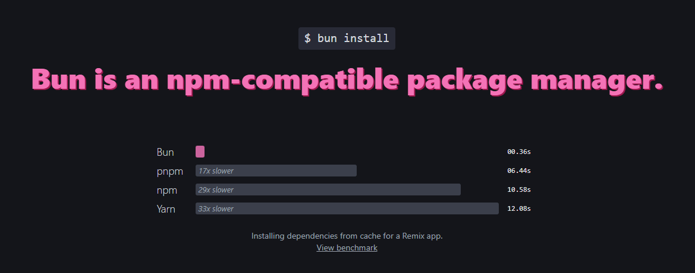

# javascript-package-managers-benchmark

Original source code <https://github.com/oven-sh/bun/tree/d879f4370db3f9cdfa79c10cf7440d16bcf52beb/bench/install>

## Global cache folders

Package managers use these directories for their global cache by default.

```sh
~/.npm/_cacache
~/.yarn/berry/cache
~/.local/share/pnpm/store
~/.bun/install/cache
```

## Lock files

```sh
package-lock.json
yarn.lock
pnpm-lock.yaml
bun.lockb
```

## Setup

Disable corepack auto pin feature so it won't add packageManager field in your package.json file.

```sh
export COREPACK_ENABLE_AUTO_PIN=0
```

Disable yarn's pnp feature. So it uses regular node_modules.

```sh
yarn config set nodeLinker node-modules
```

## Versions

```sh
❯ hyperfine --version
hyperfine 1.18.0

❯ npm --version
10.9.0

❯ yarn --version
4.5.1

❯ pnpm --version
9.12.3

❯ bun --version
1.1.34
```

## Benchmarking

### 1. No cache, no lockfile, fresh install everything

This is probably the fairest comparison. The whole point of using a package manager is to get the newer version of something, not to reuse the cache and claim it's fast.

```sh
hyperfine --warmup 1 --runs 3 \
    --prepare "rm -rf node_modules ~/.bun/install/cache; rm -f bun.lockb" "bun install" \
    --prepare "rm -rf node_modules ~/.npm/_cacache; rm -f package-lock.json" "npm install" \
    --prepare "rm -rf node_modules ~/.yarn/berry/cache; rm -f yarn.lock" "yarn install" \
    --prepare "rm -rf node_modules ~/.local/share/pnpm/store; rm -f pnpm-lock.yaml" "pnpm install"
```

Results

```sh
Benchmark 1: bun install
  Time (mean ± σ):      4.925 s ±  0.646 s    [User: 1.515 s, System: 3.407 s]
  Range (min … max):    4.432 s …  5.656 s    3 runs

Benchmark 2: npm install
  Time (mean ± σ):     65.705 s ±  3.306 s    [User: 18.858 s, System: 11.226 s]
  Range (min … max):   62.724 s … 69.261 s    3 runs

Benchmark 3: yarn install
  Time (mean ± σ):     14.311 s ±  0.641 s    [User: 14.557 s, System: 8.758 s]
  Range (min … max):   13.792 s … 15.028 s    3 runs

Benchmark 4: pnpm install
  Time (mean ± σ):      9.832 s ±  0.078 s    [User: 8.863 s, System: 4.933 s]
  Range (min … max):    9.756 s …  9.912 s    3 runs

Summary
  bun install ran
    2.00 ± 0.26 times faster than pnpm install
    2.91 ± 0.40 times faster than yarn install
   13.34 ± 1.87 times faster than npm install
```

### 2. Use cache, no lockfile

```sh
hyperfine --warmup 1 --runs 3 \
    --prepare "bun install && rm -rf node_modules && rm -f bun.lockb" "bun install" \
    --prepare "npm install && rm -rf node_modules && rm -f package-lock.json" "npm install" \
    --prepare "yarn install && rm -rf node_modules && rm -f yarn.lock" "yarn install" \
    --prepare "pnpm install && rm -rf node_modules && rm -f pnpm-lock.yaml" "pnpm install"
```

Results

```sh
Benchmark 1: bun install
  Time (mean ± σ):     816.0 ms ±  14.7 ms    [User: 105.7 ms, System: 609.4 ms]
  Range (min … max):   799.6 ms … 827.8 ms    3 runs

Benchmark 2: npm install
  Time (mean ± σ):     13.014 s ±  0.086 s    [User: 10.888 s, System: 6.628 s]
  Range (min … max):   12.915 s … 13.073 s    3 runs

Benchmark 3: yarn install
  Time (mean ± σ):      7.369 s ±  0.062 s    [User: 6.049 s, System: 4.390 s]
  Range (min … max):    7.316 s …  7.437 s    3 runs

Benchmark 4: pnpm install
  Time (mean ± σ):      6.169 s ±  0.043 s    [User: 5.959 s, System: 2.978 s]
  Range (min … max):    6.131 s …  6.215 s    3 runs

Summary
  bun install ran
    7.56 ± 0.15 times faster than pnpm install
    9.03 ± 0.18 times faster than yarn install
   15.95 ± 0.31 times faster than npm install
```

### 3. Use cache, with lockfile

```sh
hyperfine --warmup 1 --runs 3 \
    --prepare "bun install && rm -rf node_modules" "bun install" \
    --prepare "npm install && rm -rf node_modules" "npm install" \
    --prepare "yarn install && rm -rf node_modules" "yarn install" \
    --prepare "pnpm install && rm -rf node_modules" "pnpm install"
```

Results

```sh
Benchmark 1: bun install
  Time (mean ± σ):     954.1 ms ±  25.7 ms    [User: 109.2 ms, System: 743.1 ms]
  Range (min … max):   934.5 ms … 983.2 ms    3 runs

Benchmark 2: npm install
  Time (mean ± σ):     10.639 s ±  0.092 s    [User: 7.721 s, System: 6.180 s]
  Range (min … max):   10.546 s … 10.731 s    3 runs

Benchmark 3: yarn install
  Time (mean ± σ):      6.417 s ±  0.004 s    [User: 4.712 s, System: 4.804 s]
  Range (min … max):    6.413 s …  6.421 s    3 runs

Benchmark 4: pnpm install
  Time (mean ± σ):      2.021 s ±  0.006 s    [User: 2.293 s, System: 1.854 s]
  Range (min … max):    2.014 s …  2.025 s    3 runs

Summary
  bun install ran
    2.12 ± 0.06 times faster than pnpm install
    6.73 ± 0.18 times faster than yarn install
   11.15 ± 0.32 times faster than npm install
```

### 4. Use cache, with lockfile, but update a few packages

This is probably your day to day usage of package managers. Use cache, use the lockfile, and update a few packages.

```sh
hyperfine --warmup 1 --runs 3 \
    --prepare "rm -rf ~/.bun/install/cache && bun install && rm -rf node_modules && git checkout package.json && sed -i s/18.2.0/18.3.1/ package.json" "bun install" \
    --prepare "rm -rf ~/.npm/_cacache && npm install && rm -rf node_modules && git checkout package.json && sed -i s/18.2.0/18.3.1/ package.json" "npm install" \
    --prepare "rm -rf ~/.yarn/berry/cache && yarn install && rm -rf node_modules && git checkout package.json && sed -i s/18.2.0/18.3.1/ package.json" "yarn install" \
    --prepare "rm -rf ~/.local/share/pnpm/store && pnpm install && rm -rf node_modules && git checkout package.json && sed -i s/18.2.0/18.3.1/ package.json" "pnpm install"
```

Results

```sh
Benchmark 1: bun install
  Time (mean ± σ):      2.246 s ±  0.171 s    [User: 0.533 s, System: 1.970 s]
  Range (min … max):    2.101 s …  2.435 s    3 runs

Benchmark 2: npm install
  Time (mean ± σ):     11.323 s ±  0.065 s    [User: 8.293 s, System: 6.815 s]
  Range (min … max):   11.252 s … 11.380 s    3 runs

Benchmark 3: yarn install
  Time (mean ± σ):      5.751 s ±  0.018 s    [User: 3.942 s, System: 4.427 s]
  Range (min … max):    5.737 s …  5.771 s    3 runs

Benchmark 4: pnpm install
  Time (mean ± σ):      5.253 s ±  0.131 s    [User: 4.931 s, System: 3.232 s]
  Range (min … max):    5.151 s …  5.402 s    3 runs

Summary
  bun install ran
    2.34 ± 0.19 times faster than pnpm install
    2.56 ± 0.20 times faster than yarn install
    5.04 ± 0.39 times faster than npm install
```

So no, Bun cannot install packages in under half a second. It's physically impossible. However, it's quite impressive that it's almost twice as fast as its closest competitors.



## Contributing

If you find anything can be improved please feel free to submit a PR!
